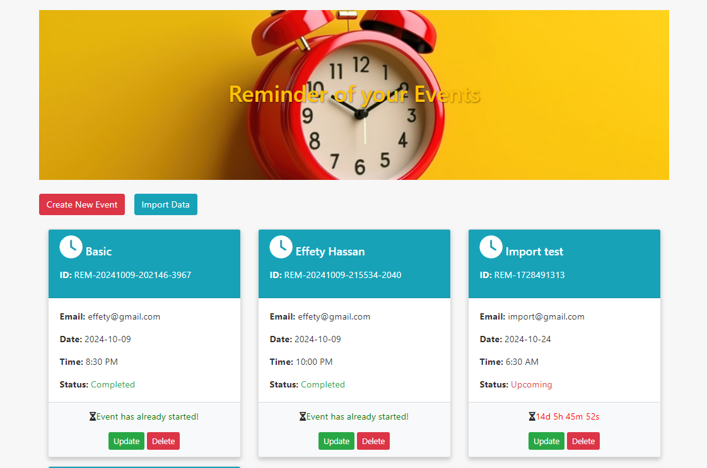
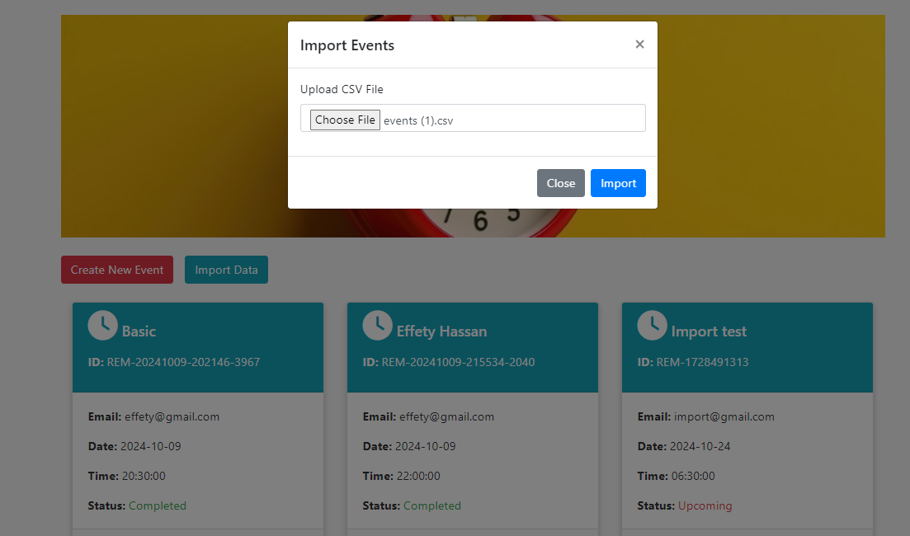
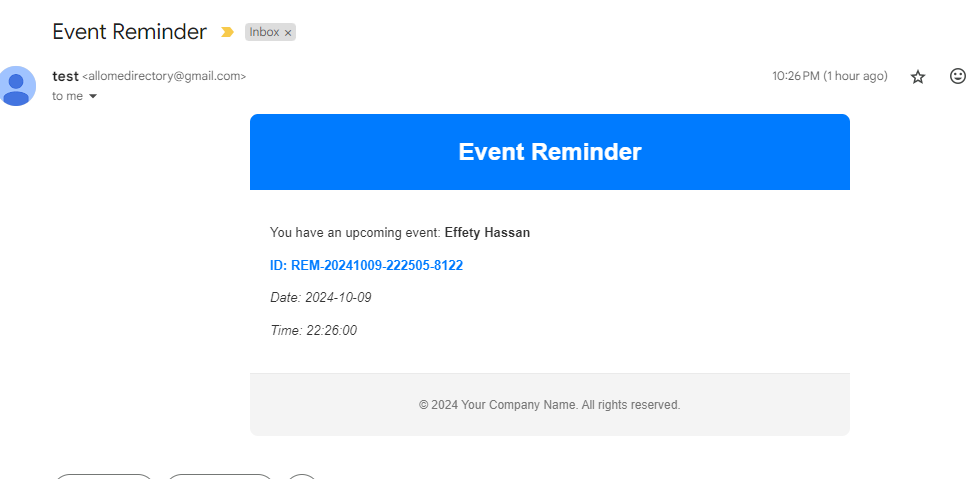
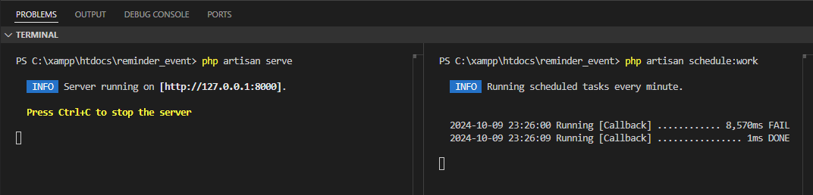

Event Reminder App
The Event Reminder App is a web-based application that allows users to manage event reminders with full CRUD (Create, Read, Update, Delete) functionality. The app also provides features for tracking upcoming and completed events, sending email reminders to external recipients at a specific time, working offline with sync capabilities, and importing event data via CSV.

Features
CRUD Operations for Events: Create, read, update, and delete event reminders easily.
Unique Event ID Generation: Each event reminder is assigned a unique ID generated by a predefined prefix format.
Offline Capability: The app can function offline, and it will automatically sync with the server once it's back online.
Email Reminders: Send event reminder emails to external recipients who are not part of the system, at a specific scheduled time.
CSV Import: Easily import event reminder data from a CSV file into the system.
Additional Email Reminder Feature:
Before sending any email, the app checks if the device is connected to the internet. If not, it will delay the email until the connection is restored, preventing issues with SMTP server errors.

The app also shows a countdown timer until the scheduled event time is reached.

Setup Instructions
Clone the Repository:
git clone https://github.com/effety/reminder_event.git

Install Dependencies:
Navigate to the project directory and install dependencies:
composer install
npm install

Create Database:
Create a database called event_reminder_db and set the database credentials in the .env file. set up the environment variables for your database, mail configuration, and other necessary settings

Run Migrations:
Set up the database structure by running the migrations:
php artisan migrate

Serve the Application:
Start the Laravel development server:
php artisan serve

Run Laravel Scheduler:

If you are testing locally on local server, open another terminal and run:
php artisan schedule:work

If you are deploying the application on a live server, add the following cron job:
crontab -e

Then add the following line:
* * * * * cd /var/www/html/reminder_event && php artisan schedule:run >> /dev/null 2>&1

Event Reminder ID Generation
Event reminders are assigned a unique ID based on a predefined prefix format. This ID is automatically generated when a new event is created.

Offline Functionality and Sync
The app supports offline usage, allowing users to continue working with event data when there's no internet connection. Once the user is back online, the app will automatically sync the changes with the server.

Email Reminders
You can set up reminder emails to be sent to external recipients at a specified time. The recipients do not need to be users of the system. Emails are scheduled and sent automatically at the defined time for each event.

To configure the email functionality, ensure that you have set up the MAIL_* variables in your .env file.

CSV Import Example:
Here is an example of the CSV format for importing event reminders:
name, email, event_Date, event_time
"Project Deadline", "example@example.com", "2024-12-01", "09:00:00"

## CSV Import Example

You can download the example CSV file [here](./instruction/events.csv).
